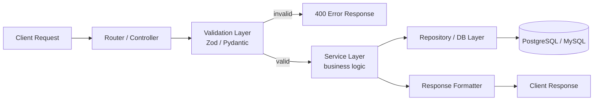
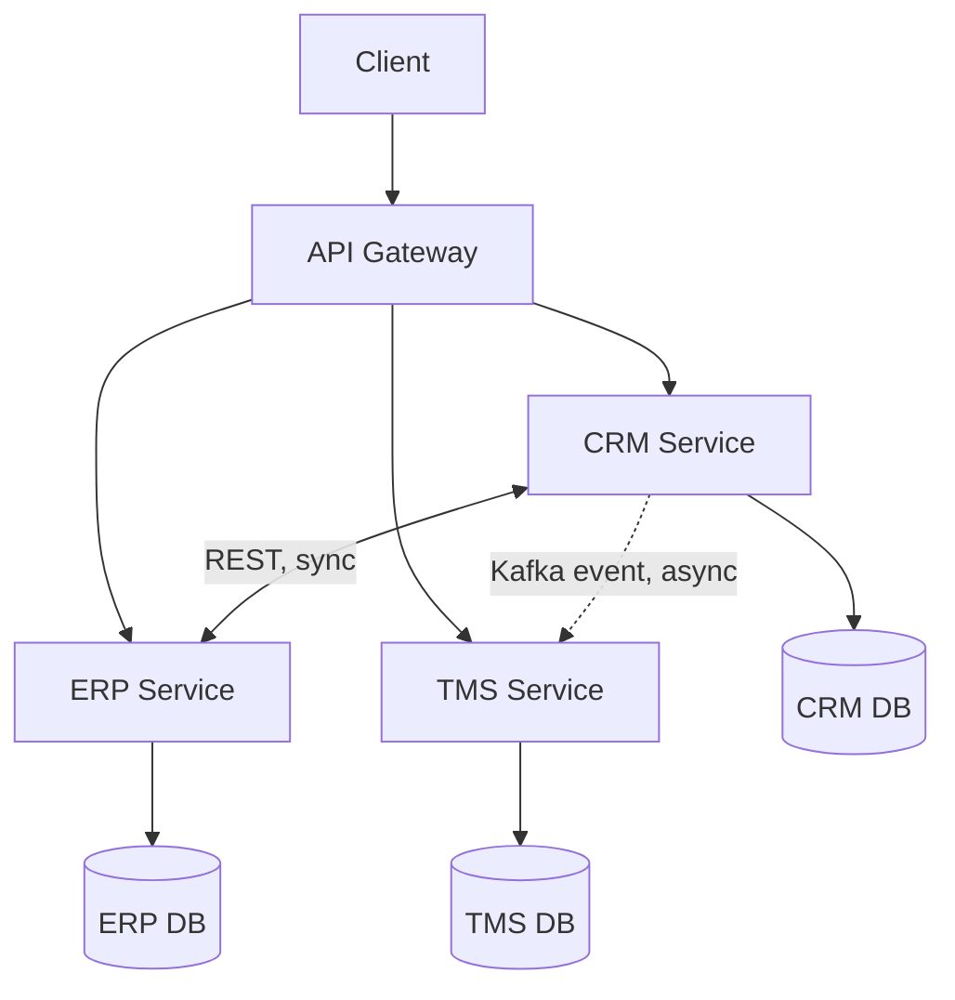
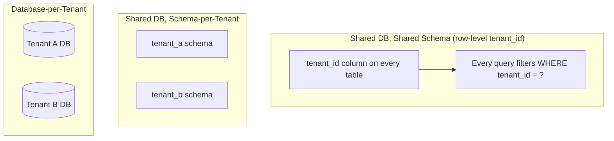
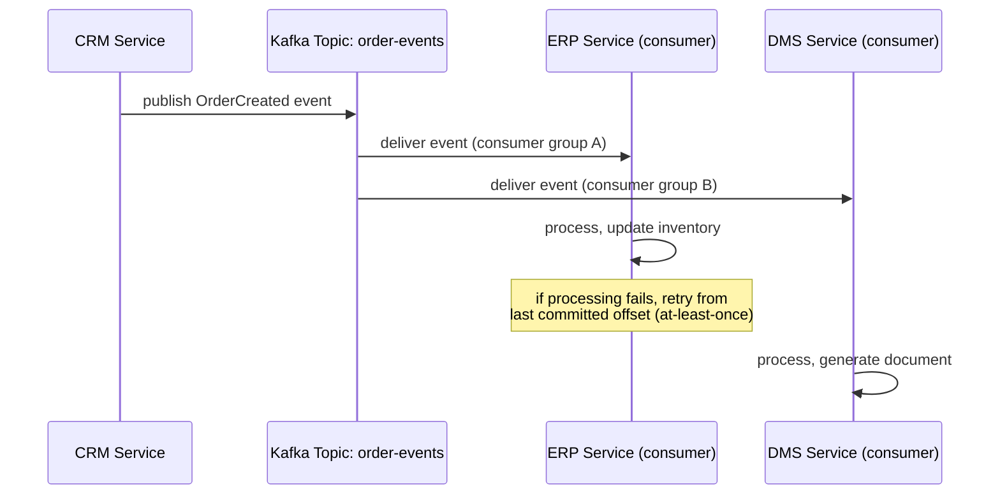
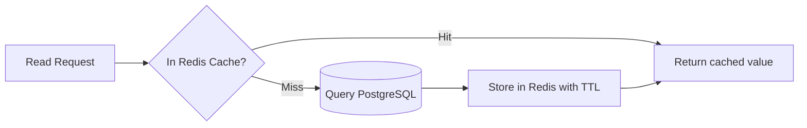
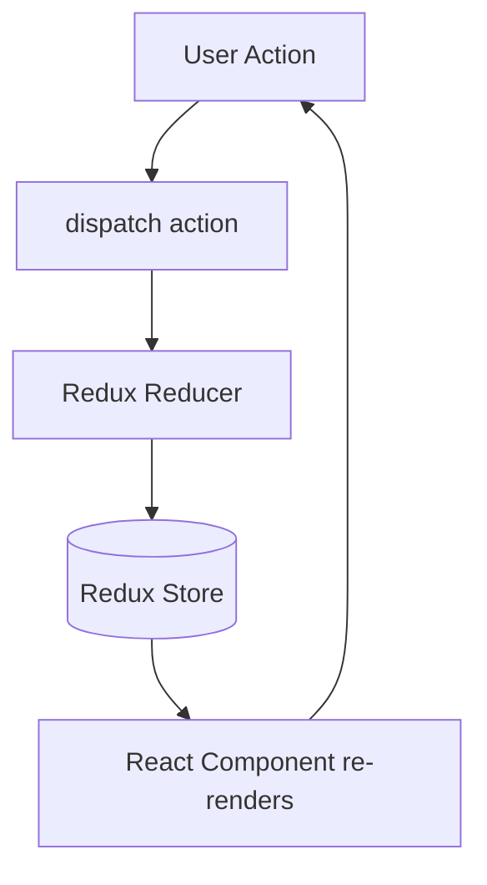
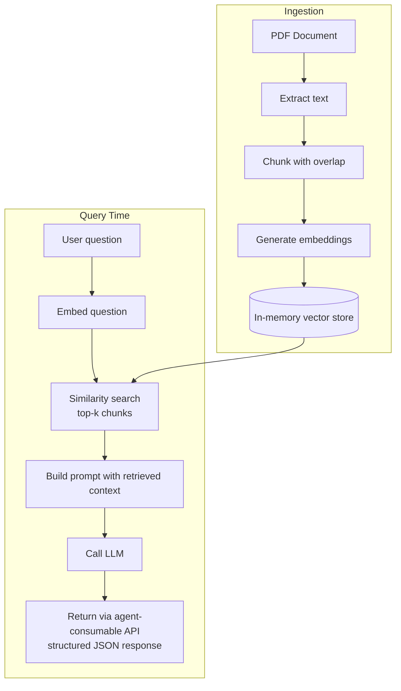
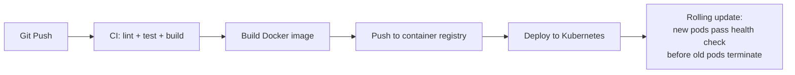
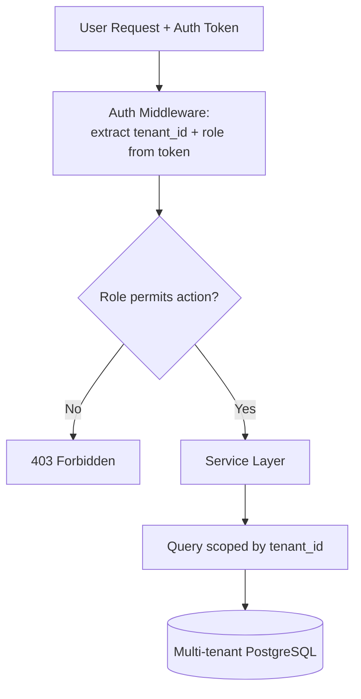
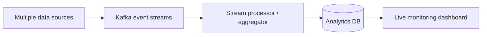

# Interview Modules — Based on Ajit Yadav's Resume

This groups your actual stack (Python/Node.js/TypeScript, Java Spring Boot, PostgreSQL/MySQL, Kafka, Redis, ElasticSearch, React, AWS/Kubernetes, and the QuickRAG project) into interview-ready modules. Each module has: **core concepts**, a **workflow diagram**, **engineering best practices**, and **resume-tailored Q&A** you can answer with your own project details.

Diagrams use Mermaid syntax — they render natively on GitHub, VS Code, and most modern Markdown viewers.

---

## Module 1: Backend REST APIs (Node.js/TypeScript & Python/FastAPI)

**Core concepts**: typed request/response contracts, input validation, layered architecture (route → controller → service → repository), consistent error shapes, versioning.

**Best practices**:
- Validate at the boundary (route layer) so invalid data never reaches business logic — fail fast with a clear 400, not a downstream 500.
- Keep controllers thin; business logic lives in the service layer so it's unit-testable without spinning up HTTP.
- Consistent error response shape (`{ error: { code, message } }`) across every endpoint, so clients don't need per-endpoint error handling.
- Version APIs from day one (`/v1/...`) even if you only have one version — retrofitting versioning later breaks existing consumers.

**Resume-tailored Q&A**

> **Q: You built typed REST APIs across CRM, ERP, TMS, DMS, and Port Management systems. How did you keep contracts "clean" across five different systems?**
> A: I treated the API contract as the source of truth, not an afterthought — defining request/response types (TypeScript interfaces / Pydantic models) up front and validating every request against them at the boundary. That meant a malformed payload from any of the five systems failed fast with a clear 400 and a specific message, instead of causing a confusing downstream error. I also kept response shapes consistent across systems — same pagination pattern, same error format — so any client consuming multiple of our APIs didn't have to special-case each one.

> **Q: How do you decide what goes in the controller vs the service layer?**
> A: The controller only translates HTTP into a plain function call and the result back into an HTTP response — no business logic. The service layer holds the actual logic and has no idea it's being called over HTTP, which is what lets me unit test it directly without mocking a request/response cycle.

---

## Module 2: Java Spring Boot & Microservice Architecture

**Core concepts**: dependency injection, layered Spring Boot apps (`@RestController` → `@Service` → `@Repository`), microservice boundaries, inter-service communication (sync REST vs async messaging), multithreading for concurrent work.

**Best practices**:
- Each microservice owns its own database — never let two services read/write the same tables directly, or you've built a distributed monolith.
- Prefer async (Kafka) over sync REST calls between services when the caller doesn't need an immediate response — it decouples services so one being slow/down doesn't cascade.
- Use a circuit breaker (e.g., Resilience4j) around sync inter-service calls so a failing downstream service doesn't exhaust the caller's threads.
- Externalize configuration (Spring Cloud Config or env vars) so the same build artifact runs across dev/staging/prod without code changes.

**Resume-tailored Q&A**

> **Q: You mention "complex schedulers, multithreading, and third-party SDK integrations" — walk me through a scenario where multithreading actually helped.**
> A: When integrating with a third-party SDK for one of the enterprise systems, calls were I/O-bound and independent of each other — e.g., pulling status updates for multiple shipments. Instead of calling them one after another, I used a thread pool to fire them concurrently, which cut total processing time roughly in proportion to the pool size, since each thread was mostly waiting on network I/O rather than competing for CPU.

> **Q: When would you choose a synchronous REST call versus an async Kafka event between two of your microservices?**
> A: If the caller needs the result immediately to continue (e.g., "does this customer exist" before creating an order), that's synchronous REST. If it's a fire-and-forget notification of something that happened (e.g., "order created," which downstream billing/reporting services care about but don't block on), that's an async Kafka event — it decouples the services so a slow or temporarily-down consumer doesn't block the producer.

---

## Module 3: Databases — PostgreSQL/MySQL & Multi-Tenant Design

**Core concepts**: schema design, indexing, query optimization, multi-tenancy patterns.

**Best practices**:
- For the common **shared-schema, row-level tenant_id** approach (what most multi-tenant SaaS uses for cost efficiency): index `tenant_id` as the *leading* column in composite indexes (`(tenant_id, created_at)`, not `(created_at, tenant_id)`) since every query filters by tenant first.
- Never trust the client to send the correct `tenant_id` — derive it server-side from the authenticated session/token, or you've built a data leak between tenants.
- Use `EXPLAIN ANALYZE` to check whether a slow query is doing a sequential scan when it should be using an index — the most common real-world query optimization win.
- Watch for the N+1 query problem in ORM-heavy code (a loop issuing one query per row) — batch with a single JOIN or `IN` clause instead.

**Resume-tailored Q&A**

> **Q: You optimized complex SQL queries for a high-volume multi-tenant system. Walk me through your actual process for finding and fixing a slow query.**
> A: I'd start with `EXPLAIN ANALYZE` on the slow query to see the actual execution plan — specifically checking if it's doing a sequential scan on a large table where an index should apply. A common fix in a multi-tenant system is making sure `tenant_id` is the leading column in a composite index, since every query filters by tenant first before anything else. I'd also check for N+1 patterns where the ORM issues one query per row in a loop, and replace that with a single batched query. After the fix, I'd re-run `EXPLAIN ANALYZE` to confirm the plan actually changed, not just assume it did.

> **Q: How would you design tenant isolation for a multi-tenant ERP so one tenant can never see another's data?**
> A: Every table that holds tenant data gets a non-nullable `tenant_id` column, and every single query — no exceptions — filters on it, ideally enforced at the data-access layer (a base repository class that automatically injects the tenant filter) rather than trusting every developer to remember it in every query. For an extra layer, PostgreSQL row-level security policies can enforce this at the database level as a backstop even if application code has a bug.

---

## Module 4: Event-Driven Architecture — Kafka & Scheduler Orchestration

**Core concepts**: producers/consumers, topics/partitions, consumer groups, delivery guarantees, idempotent processing.

**Best practices**:
- Design consumers to be **idempotent** — Kafka's default delivery guarantee is at-least-once, meaning the same message can be delivered twice (e.g., after a consumer restart before committing its offset). If processing "OrderCreated" twice would double-charge or double-create a record, add a dedupe check (e.g., an `event_id` uniqueness constraint) before Module 3's DB write.
- Use a **dead-letter topic** for messages that repeatedly fail processing, so one poison message doesn't block the whole partition indefinitely.
- Keep event payloads schema-versioned (e.g., with a schema registry or a versioned JSON schema) so producers and consumers can evolve independently without breaking each other.
- Partition by a key that keeps related events ordered (e.g., partition by `order_id`) when order matters — Kafka only guarantees ordering *within* a partition, not across the whole topic.

**Resume-tailored Q&A**

> **Q: You implemented event-driven pipelines with Kafka for high-volume async data flows. What happens if a consumer crashes mid-processing?**
> A: Kafka only advances a consumer's committed offset after it successfully processes a message, so on restart the consumer resumes from the last committed offset — which means the in-flight message at the time of the crash gets redelivered. That's why I made sure processing was idempotent, typically by checking an event ID against a table of already-processed IDs before applying the change, so a redelivered message doesn't cause a duplicate side effect like double-updating inventory.

> **Q: Why choose Kafka + async processing over the services just calling each other's REST APIs directly for this data flow?**
> A: The data flows involved multiple downstream systems (ERP, DMS, TMS) needing to react to the same event, and doing that with direct REST calls would mean the producing service has to know about and call every consumer, and a slow/down consumer blocks the producer. Kafka decouples that — the producer publishes once, any number of consumers can subscribe independently, and a consumer being temporarily down just means it catches up later instead of causing a failure upstream.

---

## Module 5: Caching & Search — Redis & ElasticSearch

**Core concepts**: cache-aside pattern, TTL/invalidation, inverted indexes for full-text search.

**Best practices**:
- **Cache-aside** (shown above) is the most common pattern: the app checks the cache first, falls back to the DB on a miss, then populates the cache — simple and gives you control over what's cached.
- Set a sensible TTL so stale data self-heals over time even if you miss an explicit invalidation somewhere; for data that changes rarely, a longer TTL is fine, for frequently-changing data, invalidate explicitly on write.
- Prevent **cache stampede** (many requests missing the cache simultaneously and all hitting the DB at once) with a lock or "only one request refreshes, others wait" pattern for hot keys.
- ElasticSearch's inverted index maps terms → documents containing them, which is why full-text search on ElasticSearch is fast compared to a `LIKE '%term%'` query on a relational DB, which can't use a standard B-tree index for substring search.

**Resume-tailored Q&A**

> **Q: Where would Redis actually help in one of the systems you worked on (CRM/ERP/TMS/DMS)?**
> A: A good candidate is frequently-read, rarely-changed reference data — like customer lookup by ID in the CRM, which gets read far more often than it's updated. I'd cache it with a TTL, and explicitly invalidate the cache entry on update so reads right after a write aren't stale for longer than necessary.

---

## Module 6: Frontend — React / Angular

**Core concepts**: component-based UI, unidirectional data flow, hooks, state management (Redux).

**Best practices**:
- Keep components focused (presentational vs container) — logic and side effects in hooks/containers, rendering in presentational components — for easier testing and reuse.
- Lift state only as high as needed; over-using global Redux state for things only one component cares about adds unnecessary complexity.
- Memoize expensive renders (`React.memo`, `useMemo`) only after profiling shows an actual re-render cost — premature memoization adds complexity without benefit.

**Resume-tailored Q&A**

> **Q: You describe React exposure as "sufficient for full-stack feature delivery" — what's a feature you shipped end-to-end?**
> A: For the ASCII Folder Tree Generator, I owned it end-to-end — a REST API backend that walked a folder structure and returned a tree representation, and a React frontend with a form to submit a path and a component to render the returned tree. State was simple enough to keep local to the component with `useState` rather than pulling in Redux for a single-page tool.

---

## Module 7: AI / LLM & RAG — QuickRAG Project

**Core concepts**: text chunking, embeddings, vector similarity search, agent-consumable API design.

**Best practices**:
- **Chunk with overlap** so an idea split across a chunk boundary still has surrounding context in at least one chunk (see the exact function pattern in the earlier coding-questions file if you built this yourself).
- **Agent-consumable API design** (explicitly called out on your resume) means: predictable, strongly-typed request/response schemas (so an agent/MCP client can call it reliably without guessing the shape), deterministic error codes (not free-text errors an agent has to parse), and idempotent endpoints where retries are safe.
- Cache embeddings for unchanged chunks — re-embedding on every request wastes cost and latency for content that hasn't changed.
- Even with an in-memory vector store, keep chunk metadata (source, page/section) alongside the vector so retrieved results can be cited back to the user — critical for trust in a RAG system.

**Resume-tailored Q&A**

> **Q: Walk me through QuickRAG's architecture and the key design decisions.**
> A: It's an end-to-end pipeline: PDFs are ingested and their text extracted, then split into overlapping chunks so context isn't lost at chunk boundaries. Each chunk is converted into an embedding and stored in an in-memory vector store for fast retrieval without the overhead of standing up a separate vector database for a project this size. At query time, the question is embedded the same way, the most similar chunks are retrieved, and they're fed into the LLM prompt as grounding context. The API layer was designed to be agent-consumable — meaning structured, predictable JSON in and out — since the eventual goal was for this kind of pipeline to be callable by an LLM agent or an MCP-style tool, not just a human-facing UI.

> **Q: Why in-memory vector retrieval instead of a dedicated vector database like FAISS or Chroma?**
> A: For QuickRAG's scale, an in-memory approach kept the project simple and dependency-light while still demonstrating the core retrieval mechanics — brute-force cosine similarity over a small set of embeddings is fast enough at that scale. I'm aware that a production system with a much larger corpus would need an approximate-nearest-neighbor index (like FAISS's HNSW) to stay fast as the number of chunks grows into the millions, which is exactly the kind of tool I'd reach for next — it's on my list to get hands-on depth with, along with LangChain and ChromaDB.

---

## Module 8: Cloud & DevOps — AWS, Kubernetes, CI/CD

**Core concepts**: containerized deployment, orchestration, IAM least privilege, CI/CD pipeline stages.

**Best practices**:
- IAM: grant the minimum permissions a service actually needs (least privilege) — a Lambda that only reads from one DynamoDB table shouldn't have account-wide DynamoDB access.
- Kubernetes: use readiness/liveness probes so a rolling deployment only routes traffic to pods that are actually ready, avoiding a bad deploy taking down the service.
- Keep secrets (DB credentials, API keys) out of container images and env files committed to Git — use a secrets manager (AWS Secrets Manager, Kubernetes Secrets) instead.
- Fail the CI pipeline fast — lint and unit tests before the slower build/integration-test stages, so a broken PR is flagged in seconds, not after a 10-minute build.

**Resume-tailored Q&A**

> **Q: You have conceptual AWS exposure (Lambda, DynamoDB, IAM) — how would you design a simple serverless endpoint using them?**
> A: An API Gateway endpoint triggers a Lambda function, which reads/writes to DynamoDB for storage. The Lambda's IAM execution role would be scoped to only the specific DynamoDB table and actions it needs (e.g., `GetItem`/`PutItem` on one table), not broad DynamoDB access, following least privilege. For anything sensitive, I'd pull secrets from Secrets Manager at runtime rather than hardcoding them into the function's environment variables in plaintext.

---

## Module 9: System Design — Multi-Tenant ERP & Real-Time Analytics

**Ticket Management ERP (multi-tenant, RBAC)**

**Real-Time Analytics Platform**

**Best practices**:
- RBAC should be enforced server-side on every request, never trusted from client-side UI hiding (a hidden button isn't a security control).
- Design the analytics pipeline for backpressure: if the dashboard/consumer is slower than the event producers, Kafka's buffering absorbs the burst rather than data being dropped — but you still need monitoring on consumer lag to catch a growing backlog.

**Resume-tailored Q&A**

> **Q: How did you implement role-based access control in the multi-tenant ERP?**
> A: The auth token carries both the tenant ID and the user's role after login. Every request goes through middleware that extracts both, and the service layer checks the role against the required permission for that action before executing it — so even if someone crafted a request directly (bypassing the UI), the same server-side check applies. Data queries are always additionally scoped by tenant_id regardless of role, so role controls *what* you can do, and tenant scoping controls *whose* data you can ever see.

---

## Module 10: Testing, Documentation & Agile Practices

**Core concepts**: unit vs integration testing (JUnit), API testing (Postman), Agile/Scrum cadence, documentation habits.

**Best practices**:
- Write tests for the behavior/contract, not the implementation detail — so refactoring internals doesn't break tests that don't actually care how the result was computed.
- Use Postman collections as living, shareable API documentation and regression checks — export them into the CI pipeline (e.g., via Newman) so contract regressions are caught automatically, not just manually.
- Document *why* a non-obvious decision was made, not just *what* the code does — the "what" is visible in the code itself; the "why" is what gets lost otherwise.

**Resume-tailored Q&A**

> **Q: You mention "strong documentation habits" and documenting API changes for team-wide knowledge sharing — what does good API documentation actually include for you?**
> A: Beyond the request/response schema, I include why a field exists if it's not obvious, what changed and why in a changelog entry for breaking changes, and a couple of realistic example requests/responses — because the schema alone doesn't tell a new team member which fields are actually required in practice versus technically optional. For cross-timezone teams especially, that upfront documentation prevents a lot of back-and-forth that would otherwise cost a full day's delay waiting for the other timezone to wake up.

---

## How to Use This File
- For each module, be ready to swap the generic example in the Q&A for a *more specific* memory from that actual project if the interviewer digs deeper — these answers are a strong starting scaffold, not a script to recite verbatim.
- The diagrams are also useful to literally redraw on a whiteboard/shared doc if asked to explain one of these systems live — practice drawing 2–3 of them from memory.
